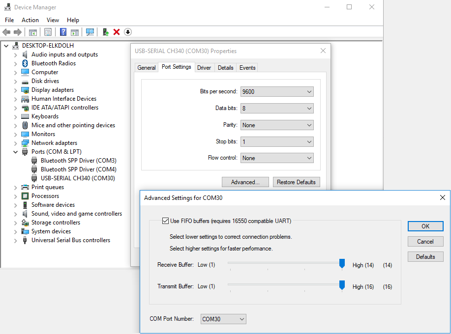

# ArduinoToFoobar
This is a hidden program ran in the background which reads serial data from an Arduino.  
When a button is pressed on the Arduino it sends a serial command which is read by this program.  
The command will allow the control of music playback within foobar2000.

### Read before running...
This program will select the first com port, which will be the COM port with the highest number from what I have tested.
Find the arduino within device manager and change its port number to something high such as 30.

Foobar2000 location will also need appended within the source code.